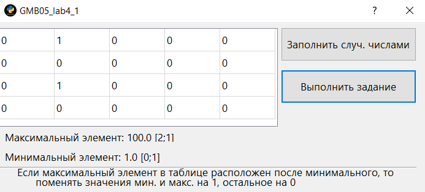

# GMB05_lab4_1_Python
Practical work 4_1. In the discipline of Cross-platform Application Development  If the maximum element in the table is located after the minimum, then change the value of the maximum and minimum by 1.



Код реализации алгоритма
```
pol_min = list_information_max_num[4] * self.tableWidget.rowCount() + list_information_max_num[5] + 1
        pol_max = list_information_max_num[1] * self.tableWidget.rowCount() + list_information_max_num[2] + 1

        if (pol_max > pol_min):
            while row < self.tableWidget.rowCount():
                while col < self.tableWidget.columnCount():
                    number = [float(self.tableWidget.item(row, col).text()), row, col]
                    if number != list_information_max_num:
                        self.tableWidget.setItem(row, col, QTableWidgetItem(str(num_zero)))
                        self.tableWidget.setItem(list_information_max_num[1], list_information_max_num[2], QTableWidgetItem(str(num_one)))
                        self.tableWidget.setItem(list_information_max_num[4], list_information_max_num[5], QTableWidgetItem(str(num_one)))
                    col += 1
                row += 1
                col = 0
        else:
            self.label_error.setText('Условия не выполнены!')
```

Teacher: https://github.com/proffix4
